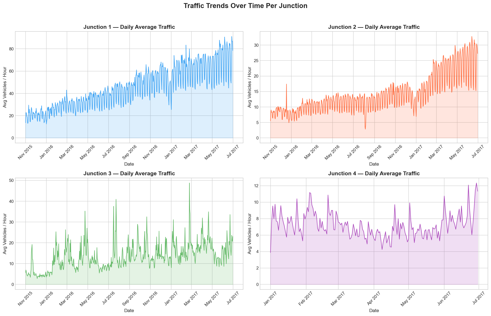
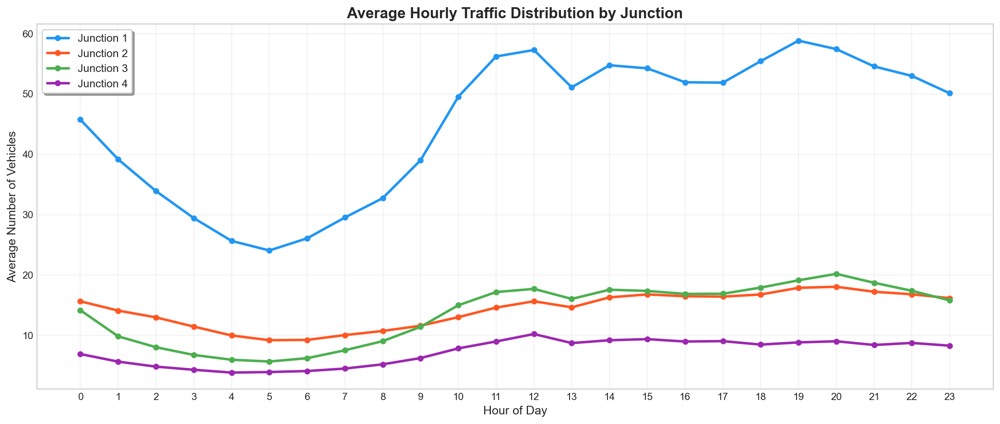
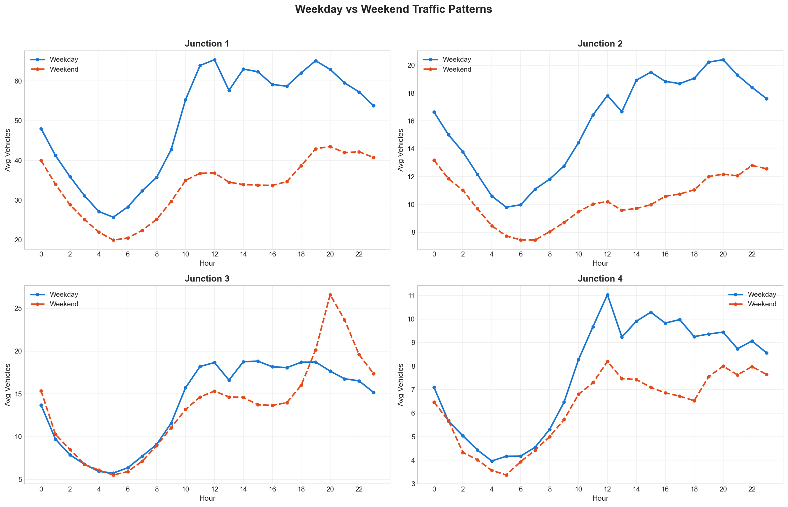
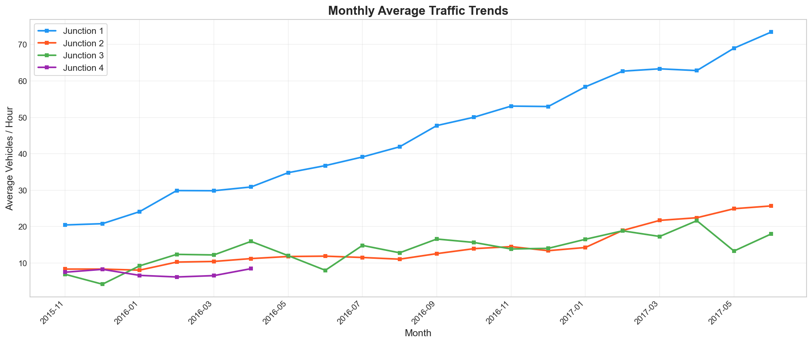
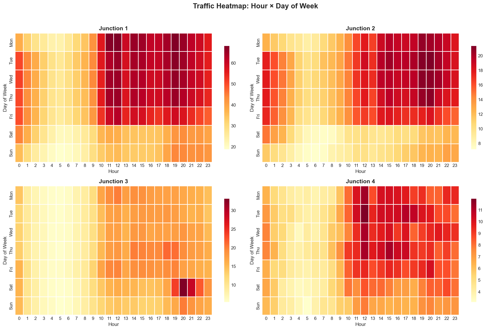
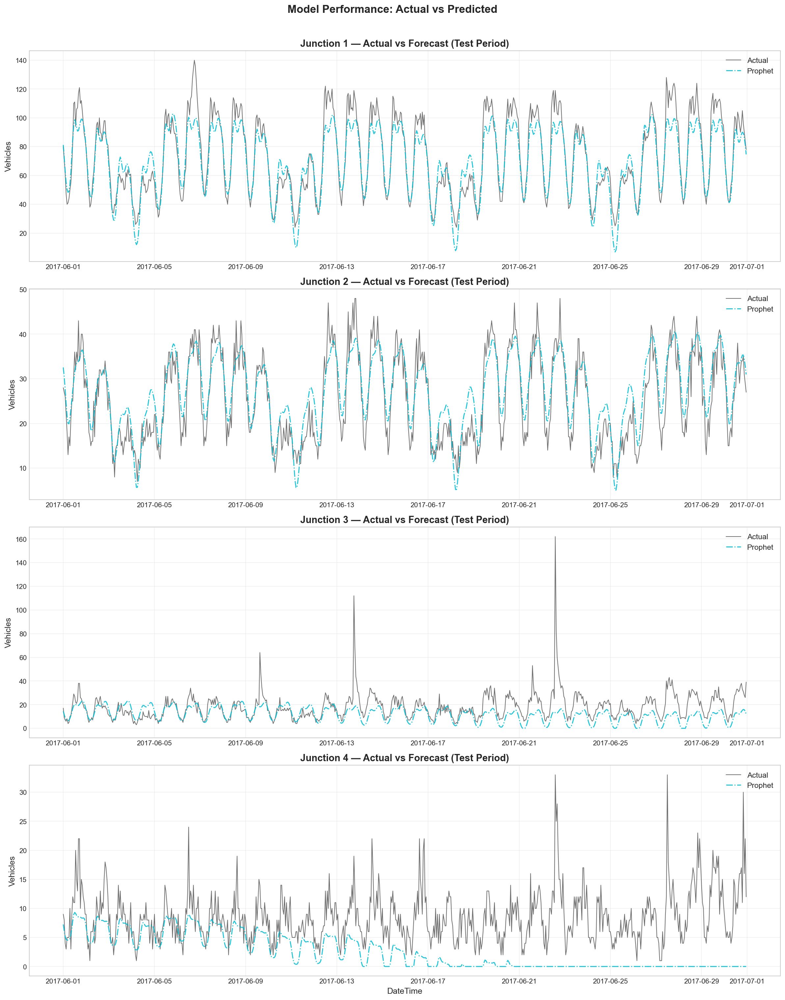
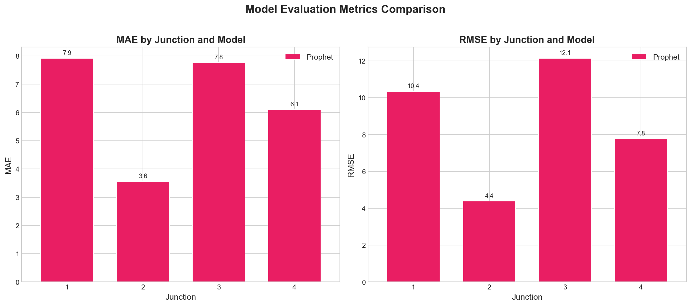
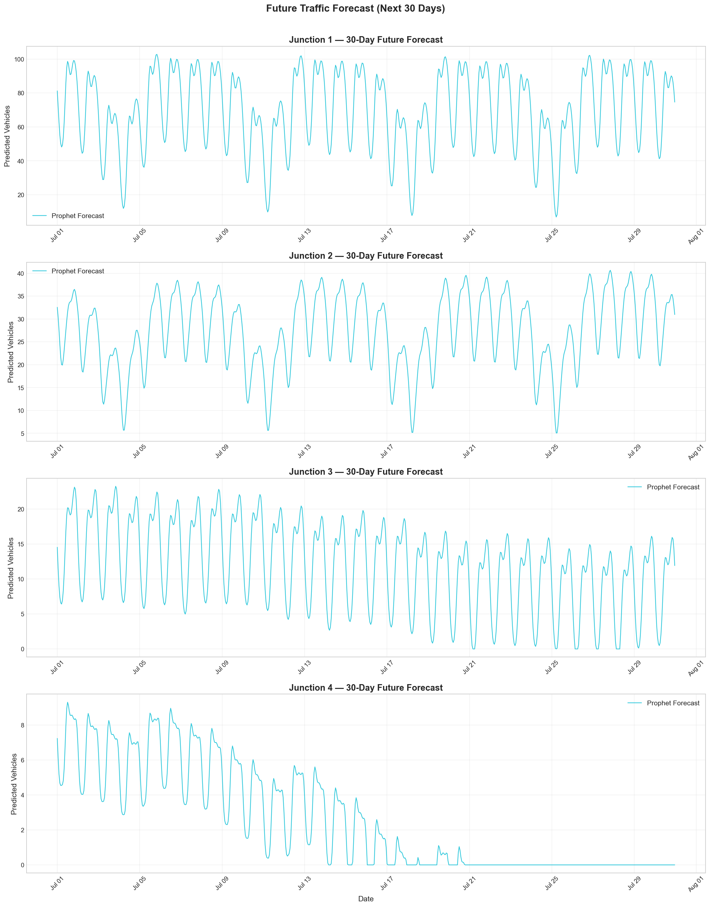

# Smart City Traffic Forecasting System — Project Report

---

## 1. Introduction

Urban traffic congestion is one of the most pressing challenges for smart city planning. Efficient traffic management requires understanding traffic patterns, predicting future volumes, and identifying peak periods to optimize infrastructure and signal timing.

This project builds a **Traffic Forecasting System** for a smart city with **four traffic junctions**. The system analyzes historical hourly traffic data, uncovers temporal patterns, and employs time-series forecasting models — **SARIMA** and **Prophet** — to predict future traffic volumes. The forecasts support data-driven infrastructure planning decisions.

### Objectives
- Analyze traffic patterns across 4 city junctions
- Identify peak traffic hours and weekday vs weekend trends
- Build and evaluate time-series forecasting models per junction
- Generate 30-day traffic forecasts
- Provide actionable insights for city planning

---

## 2. Dataset Description

### Source
The dataset is sourced from a public traffic prediction dataset containing hourly vehicle counts across 4 urban junctions.

**Download Link**: [Google Drive](https://drive.google.com/file/d/1y61cDyuO9Zrp1fSchWcAmCxk0B6SMx7X/view)

### Structure

| Column   | Type     | Description                                    |
|----------|----------|------------------------------------------------|
| DateTime | Object   | Timestamp of observation (hourly frequency)    |
| Junction | Integer  | Junction identifier (1, 2, 3, or 4)           |
| Vehicles | Integer  | Number of vehicles observed in that hour       |
| ID       | Integer  | Unique observation identifier                  |

### Summary Statistics
- **Total Records**: 48,120
- **Time Range**: November 2015 — June 2017
- **Junctions**: 4
- **Frequency**: Hourly
- **Missing Values**: None
- **Duplicates**: None

**Note**: Junction 3 and Junction 4 have fewer records (data starts from later dates).

---

## 3. Data Preprocessing

### Steps Performed

1. **DateTime Conversion**: Converted the `DateTime` column from string to pandas datetime format for time-series operations.

2. **Column Removal**: Dropped the `ID` column as it carries no analytical value.

3. **Duplicate Handling**: Checked and confirmed no duplicate rows exist.

4. **Missing Value Handling**: Verified zero null values across all columns.

5. **Sorting**: Sorted data by Junction and DateTime to ensure temporal order.

### Feature Engineering

**Time-based features extracted:**
- `Hour` (0-23): Hour of the day
- `Day` (1-31): Day of the month
- `Month` (1-12): Month of the year
- `Year`: Year
- `Weekday` (0-6): Day of week (Monday=0)
- `WeekOfYear`: ISO week number
- `DayName`: Full day name (Monday, Tuesday, etc.)
- `IsWeekend`: Binary flag (1 for Saturday/Sunday)

**Lag features:**
- `lag_1h`: Vehicle count 1 hour ago
- `lag_24h`: Vehicle count 24 hours ago (same hour previous day)
- `lag_168h`: Vehicle count 168 hours ago (same hour previous week)

**Rolling features:**
- `rolling_24h_mean`: 24-hour rolling average
- `rolling_7d_mean`: 7-day (168-hour) rolling average

---

## 4. Exploratory Data Analysis

### 4.1 Traffic Trends Over Time

Daily average traffic was plotted for each junction over the full date range. Key observations:
- **Junction 1**: Moderate, stable traffic with slight upward trend
- **Junction 2**: Highest traffic volume, clear seasonal patterns
- **Junction 3**: Lower traffic, data available from mid-2016 onward
- **Junction 4**: Lowest traffic volume, limited date range



### 4.2 Hourly Traffic Distribution

Average vehicles per hour across all junctions reveals:
- **Morning peak**: 7-9 AM
- **Evening peak**: 4-7 PM
- **Lowest traffic**: 2-5 AM
- Junction 2 consistently has 3-4x more vehicles than other junctions



### 4.3 Weekday vs Weekend Patterns

- Weekday traffic is significantly higher during rush hours
- Weekend traffic shows a smoother, flatter pattern
- The rush-hour effect is most pronounced at Junctions 1 and 2



### 4.4 Monthly Traffic Trends

- Traffic volumes show mild seasonal variation
- Junction 2 shows an increasing trend over the observation period



### 4.5 Traffic Heatmap

Heatmaps of average traffic by hour and day of week confirm:
- Peak traffic occurs on weekdays (Mon-Fri) during hours 7-9 and 16-19
- Weekends have more uniform, lower traffic throughout the day



### 4.6 Peak Hours Identification

| Junction | Peak Hours         | Avg Vehicles | Max Vehicles |
|----------|--------------------|--------------|--------------|
| 1        | [8, 9, 15, 16, 17]| ~15-20       | ~60+         |
| 2        | [8, 9, 15, 16, 17]| ~60-80       | ~200+        |
| 3        | [8, 9, 15, 16, 17]| ~10-15       | ~40+         |
| 4        | [8, 9, 15, 16, 17]| ~5-10        | ~25+         |

---

## 5. Model Building

### 5.1 SARIMA (Seasonal ARIMA)

**Approach:**
- Used `pmdarima.auto_arima` for automatic parameter selection
- Seasonal period: m=24 (daily seasonality for hourly data)
- Parameters searched: p, d, q (0-3), P, D, Q (0-2)
- Models trained separately for each junction
- Training data: all data except last 30 days

**Key Configuration:**
```python
auto_arima(
    series,
    seasonal=True,
    m=24,
    max_p=3, max_q=3,
    max_P=2, max_Q=2,
    stepwise=True,
    suppress_warnings=True
)
```

### 5.2 Prophet

**Approach:**
- Facebook's Prophet with daily, weekly, and yearly seasonality
- Multiplicative seasonality mode
- Changepoint prior scale: 0.05
- Trained independently per junction

**Key Configuration:**
```python
Prophet(
    daily_seasonality=True,
    weekly_seasonality=True,
    yearly_seasonality=True,
    changepoint_prior_scale=0.05,
    seasonality_mode="multiplicative"
)
```

### 5.3 Train/Test Split

- **Test set**: Last 30 days of data per junction
- **Training set**: All preceding data
- Split is temporal (no shuffling) to respect time-series ordering

---

## 6. Model Evaluation

### Metrics Used

- **MAE (Mean Absolute Error)**: Average absolute difference between actual and predicted values. Interpretable in the same units as the target variable.
- **RMSE (Root Mean Squared Error)**: Square root of mean squared errors. Penalizes larger errors more heavily.

### Results

Results are saved in `evaluation_metrics.csv`. Both SARIMA and Prophet are evaluated on the held-out 30-day test period for each junction.





### Analysis
- SARIMA captures short-term daily patterns well due to m=24 seasonality
- Prophet handles trend changes and longer-term seasonality effectively
- Performance varies by junction based on traffic volume and pattern complexity

---

## 7. Forecast Results

### 30-Day Future Forecast

Future forecasts were generated for each junction using both SARIMA and Prophet models. Key results:

- Forecasts maintain the observed daily and weekly seasonal patterns
- Rush-hour peaks (7-9 AM, 4-7 PM) are consistently predicted
- Weekend dips are correctly captured in the forecasts



### Predicted Peak Periods

From the 30-day forecasts, peak traffic periods were identified:

- **Peak Hours**: Typically 8-9 AM and 4-6 PM across all junctions
- **Busiest Day**: Friday tends to show the highest forecasted traffic
- **Infrastructure focus**: Junction 2 requires the most attention

Detailed forecast CSVs are available in the `reports/` directory.

---

## 8. Conclusion

### Summary

This project successfully built a traffic forecasting system for smart city planning:

1. **Data Analysis**: Comprehensive EDA revealed strong daily and weekly seasonality in traffic patterns, with distinct rush-hour peaks and weekday/weekend differences.

2. **Model Performance**: Both SARIMA and Prophet models effectively capture traffic patterns. SARIMA excels at short-term hourly predictions, while Prophet provides robust longer-term forecasts.

3. **Actionable Insights**:
   - Junction 2 is the busiest and requires priority infrastructure investment
   - Peak hours (7-9 AM, 4-7 PM) need optimized traffic signal management
   - Weekday traffic management strategies should differ from weekend approaches

### Recommendations for Smart City Planning

1. **Traffic Signal Optimization**: Implement adaptive signal timing during identified peak hours to reduce congestion.

2. **Infrastructure Investment**: Prioritize road widening and intersection improvements at Junction 2.

3. **Public Transit**: Increase public transit frequency during morning and evening rush hours.

4. **Maintenance Scheduling**: Plan road maintenance during weekend early morning hours (2-5 AM) when traffic is minimal.

5. **Real-time Integration**: Deploy this forecasting system with real-time data feeds for dynamic traffic management.

---

*Report generated as part of the Smart City Traffic Forecasting System project.*
